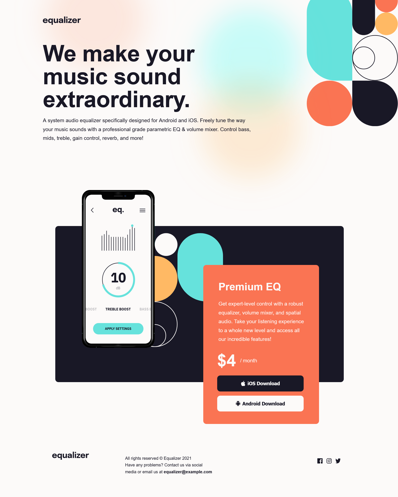

# Frontend Mentor - Equalizer landing page solution

This is a solution to the [Equalizer landing page challenge on Frontend Mentor](https://www.frontendmentor.io/challenges/equalizer-landing-page-7VJ4gp3DE). Frontend Mentor challenges help you improve your coding skills by building realistic projects. 

### The challenge

Users should be able to:

- View the optimal layout depending on their device's screen size
- See hover states for interactive elements


### Screenshot



### Links

- Solution URL: [https://github.com/GIGAKLIBADZE/equalizer-landing-page]
- Live Site URL: [https://equalizer-landing-page-3vw8w8hn1-gigas-projects.vercel.app/]


### Built with

- Semantic HTML5 markup
- CSS custom properties
- Flexbox
- Mobile-first workflow
- [https://www.figma.com/file/HB7XoWK6Ufc0Fy2TYawY2i/equalizer-landing-page?node-id=0%3A144&mode=dev] - For styles

### What I learned

 Now, I have better knowledge about some of the CSS properties, include position property. Also I learned how to change the icon color by by filter
property. And here is the code:

```css
 .facebook-icon:hover {
        cursor: pointer;
        filter: invert(48%) sepia(96%) saturate(417%) hue-rotate(322deg) brightness(101%) contrast(96%);
}
```

### Useful resources

- [https://www.w3schools.com/] - Ths is the site which I have introduced some of the details about CSS from.
- [https://isotropic.co/tool/hex-color-to-css-filter/] - From this site I filtered hex color to CSS.

## Author

- Website - [https://github.com/GIGAKLIBADZE]


